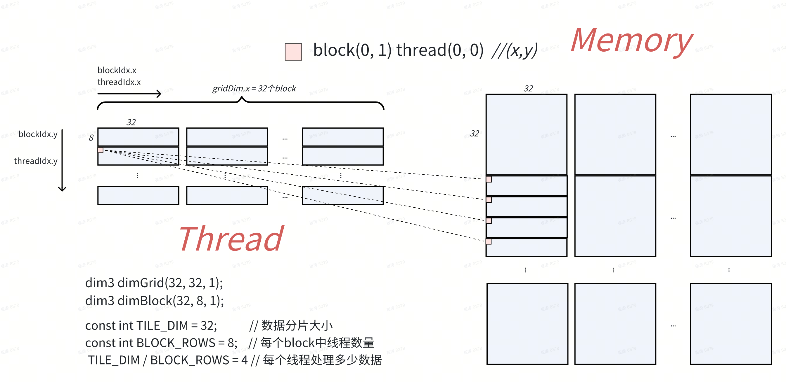
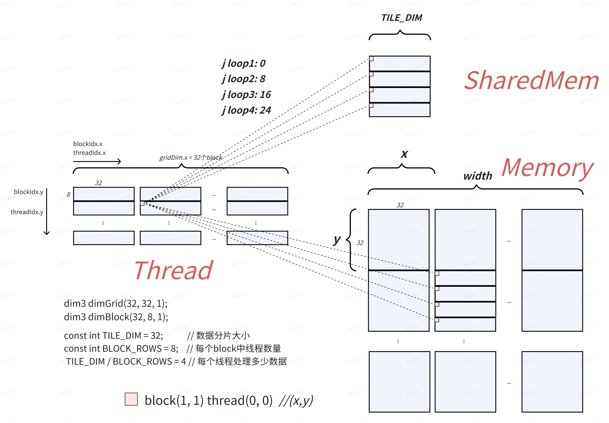
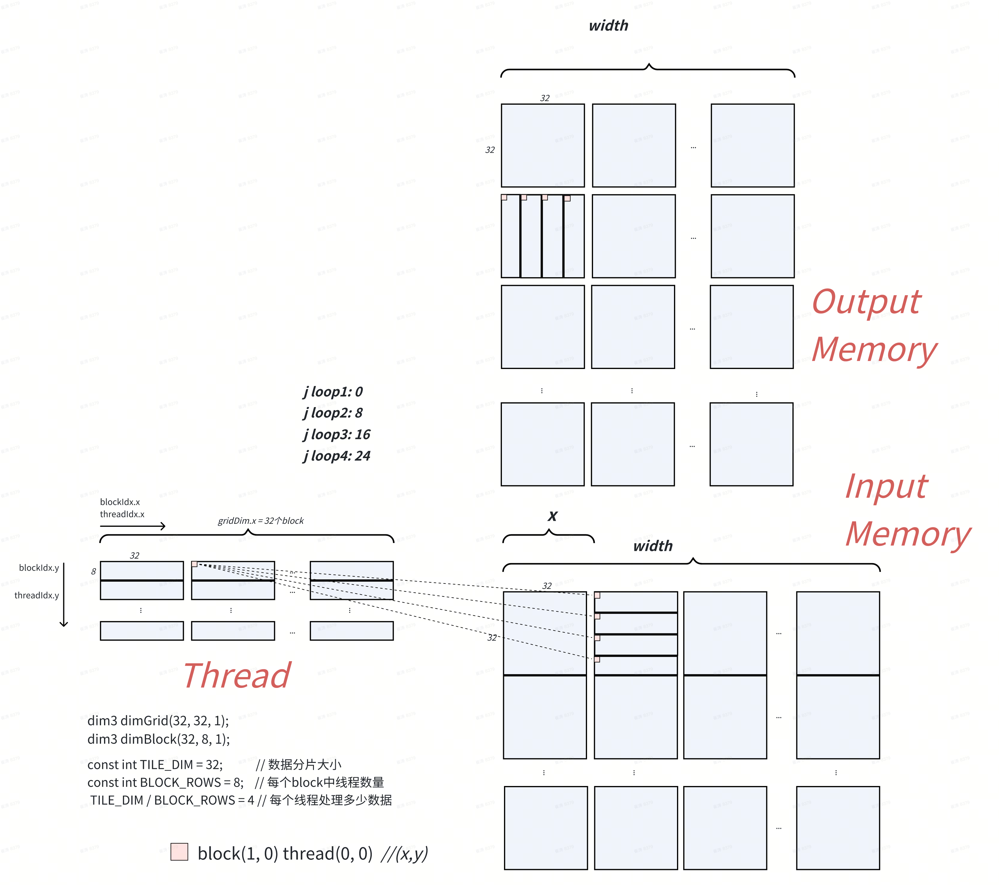
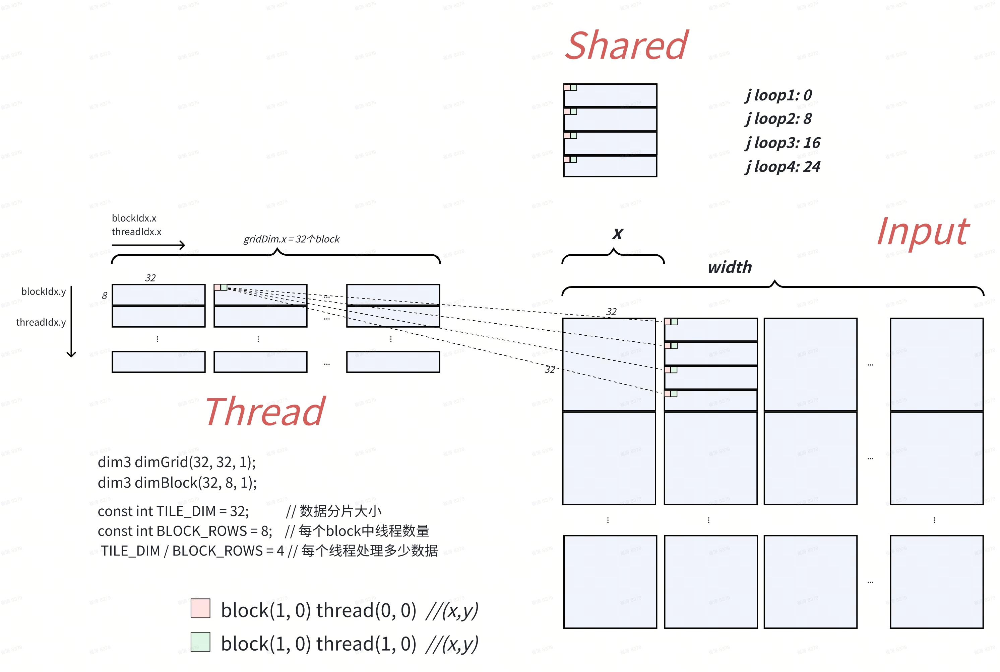
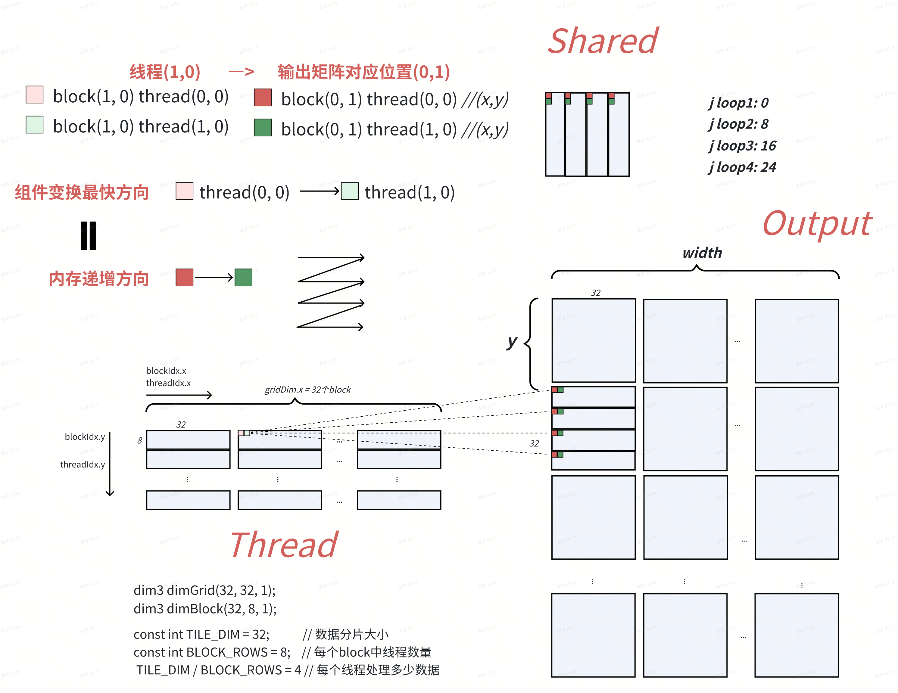

```C++
const int TILE_DIM = 32;        // 数据分片大小
const int BLOCK_ROWS = 8;       // 每个block中线程数量

const int nx = 1024;            // 矩阵x轴
const int ny = 1024;            // 矩阵y轴
```

# Copy

```C++
__global__ void copy(float *odata, const float *idata) {
    int x = blockIdx.x * TILE_DIM + threadIdx.x;    // 数据：x 偏移 0*32 + 0
    int y = blockIdx.y * TILE_DIM + threadIdx.y;    // 数据：y 偏移 1*32 + 0
    int width = gridDim.x * TILE_DIM;               // x轴 数据量 (nx) 32*32 = 1024
    
    // 一个线程处理 TILE_DIM / BLOCK_ROWS = 4 个数据
    // j += BLOCK_ROWS 数据按 BLOCK_ROWS 分隔
    for (int j = 0; j < TILE_DIM; j += BLOCK_ROWS) 
        odata[(y+j)*width + x] = idata[(y+j)*width + x];
}
```



# copySharedMem

```C++
__global__ void copySharedMem(float *odata, const float *idata) {
    __shared__ float tile[TILE_DIM * TILE_DIM];

    int x = blockIdx.x * TILE_DIM + threadIdx.x;
    int y = blockIdx.y * TILE_DIM + threadIdx.y;
    int width = gridDim.x * TILE_DIM;

    for (int j = 0; j < TILE_DIM; j += BLOCK_ROWS) 
        tile[(threadIdx.y+j)*TILE_DIM + threadIdx.x] = idata[(y+j)*width + x];

    __syncthreads();
    
    for (int j = 0; j < TILE_DIM; j += BLOCK_ROWS)
        odata[(y+j)*width + x] = tile[(threadIdx.y+j)*TILE_DIM + threadIdx.x];
}
```

**Global Memory -> Shared Memory**



**Shared Memory -> Global Memory**

# transposeNaive

```Java
__global__ void transposeNaive(float *odata, float *idata) {
    int x = blockIdx.x * TILE_DIM + threadIdx.x;        // 数据: x偏移 [例]1*32 + 0
    int y = blockIdx.y * TILE_DIM + threadIdx.y;        // 数据: y偏移 [例]1*32 + 0
    int width = gridDim.x * TILE_DIM;

    // idata[(32 + 0/8/16/24) * 1024 + 32] -> odata[32*1024 + (32 + 0/8/16/24)]
    for (int j = 0; j < TILE_DIM; j += BLOCK_ROWS) 
        odata[x*width + (y + j)] = idata[(y+j)*width + x];
}
```



# transposeCoalesced

```C++
__global__ void transposeCoalesced(float *odata, const float *idata){
    __shared__ float tile[TILE_DIM][TILE_DIM];

    int x = blockIdx.x * TILE_DIM + threadIdx.x;    // 数据: x偏移 [例]1*32 + 0
    int y = blockIdx.y * TILE_DIM + threadIdx.y;    // 数据: y偏移 [例]1*32 + 0
    int width = gridDim.x * TILE_DIM;

    // idata[(32 + 0/8/16/24)*1024 + 32] -> tile[(0/8/16/24)][0]
    for (int j = 0; j < TILE_DIM; j += BLOCK_ROWS)
        tile[threadIdx.y + j][threadIdx.x] = idata[(y+j) * width + x];

    __syncthreads();

    x = blockIdx.y * TILE_DIM + threadIdx.x;  // transpose block offset
    y = blockIdx.x * TILE_DIM + threadIdx.y;

    // tile[0][(0/8/16/24)] -> odata[(32 + 0/8/16/24)*1024 + 32]
    for (int j = 0; j < TILE_DIM; j += BLOCK_ROWS)
        odata[(y+j)*width + x] = tile[threadIdx.x][threadIdx.y + j];
}
```

**Global memory -> Shared memory**



**Shared memory -> Global memory**


